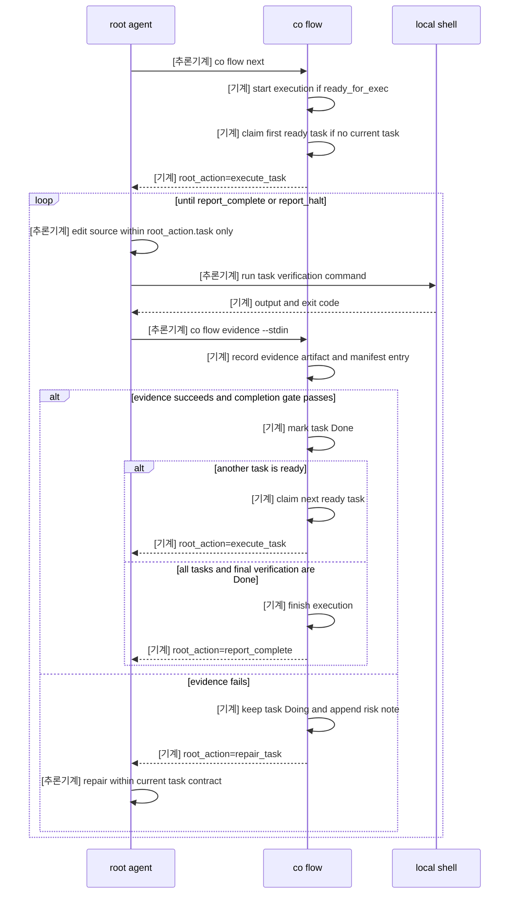
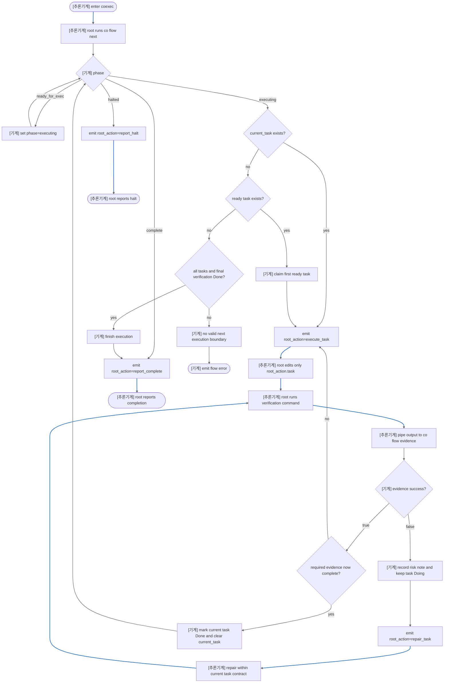

# Coexec Runtime Graphs

This document maps the runtime flow for `coexec`.
The root agent must execute only the current task returned by `co flow` and send verification output back through `co flow evidence`.

## Sequence Diagram

## Flowchart

## Label Meaning

- `[기계]`: code-executed deterministic work such as state transition, evidence write, task claim, task completion, halt, or finish.
- `[추론기계]`: root-agent action that edits source, runs verification, calls `co flow`, or reports a returned root action.
- Flowchart edge colors match the same roles: blue for `[추론기계]` and gray for `[기계]`.
