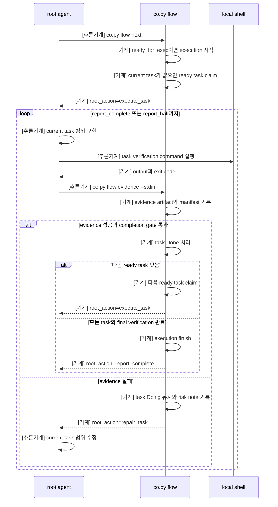
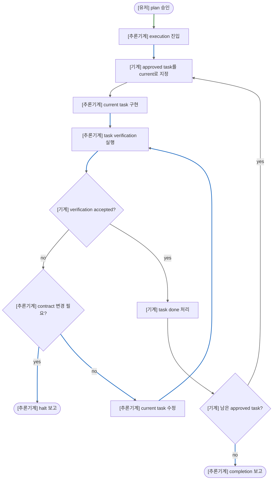

# Coexec 흐름도

이 문서는 `coexec`가 승인된 plan bundle을 current task 단위로 실행하는 흐름을 보여주는 사용자용 문서다.
그래프의 초점은 `co.py flow`가 task 선택과 completion을 관리하고, root agent가 구현과 검증 실행을 맡는 방식이다.

## Sequence Diagram

## Flowchart

## Label Meaning

- `[기계]`: state transition, evidence write, task claim, task completion, halt, finish처럼 코드로 실행되는 단계.
- `[추론기계]`: root agent가 source를 수정하거나 verification을 실행하거나 `co.py flow`를 호출하거나 반환된 action을 보고하는 단계.
- `[유저]`: plan 승인처럼 사용자가 흐름을 시작시키는 입력.
- Flowchart edge 색상은 같은 역할을 따른다. blue는 `[추론기계]`, gray는 `[기계]`, green은 `[유저]`다.
