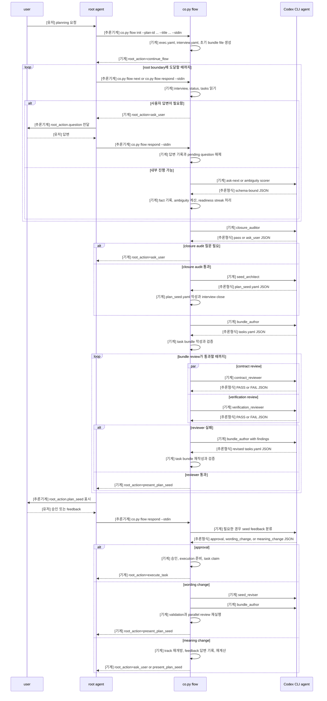
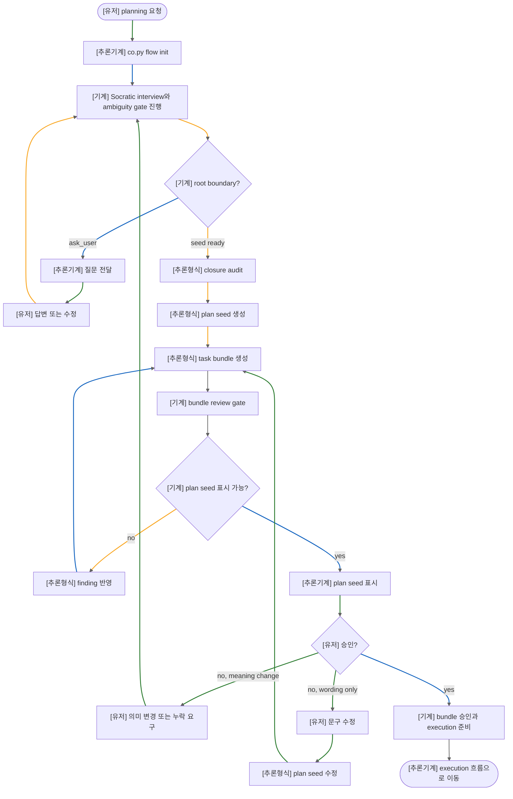

# Coplan 흐름도

이 문서는 `coplan`이 사용자 요청을 실행 가능한 plan bundle로 바꾸는 흐름을 보여주는 사용자용 문서다.
그래프의 초점은 user, root agent, `co.py flow`, Codex CLI agent 사이에서 제어가 이동하는 방식이다.

## Sequence Diagram

## Flowchart

## Label Meaning

- `[기계]`: file read/write, schema validation, state transition, subprocess launch, stdout emission처럼 코드로 실행되는 단계.
- `[추론기계]`: root agent가 `co.py flow`를 호출하거나 `root_action`의 사용자 표시 내용을 전달하는 단계.
- `[유저]`: 사용자가 작성한 요청, 답변, feedback, approval.
- `[추론형식]`: JSON schema 같은 정해진 출력 형식 안에서 이뤄지는 AI 판단.
- Flowchart edge 색상은 같은 역할을 따른다. green은 `[유저]`, blue는 `[추론기계]`, gray는 `[기계]`, yellow는 `[추론형식]`이다.
