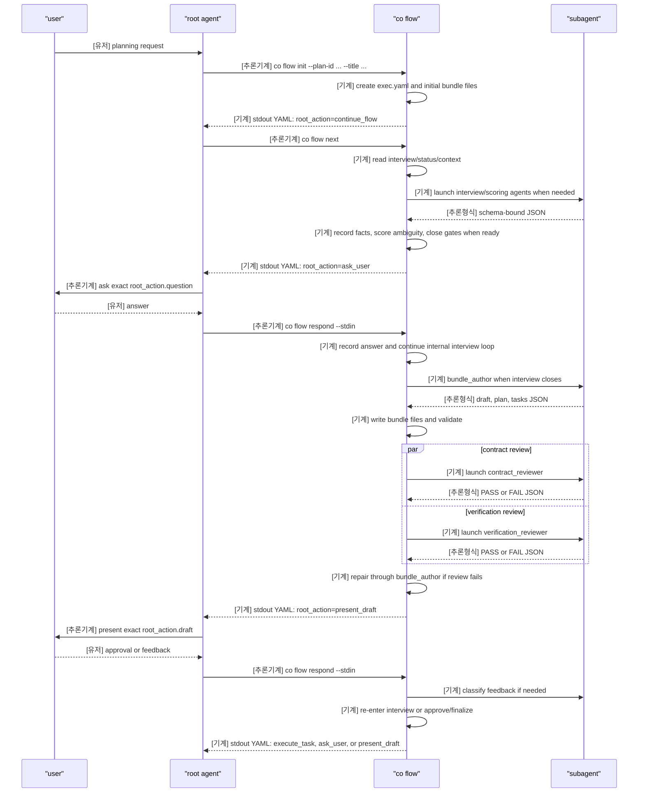

# Coplan Interaction Sequence

This document maps the runtime interaction order for `coplan`.
The root agent must treat `co flow` stdout YAML as the control contract and keep the planning flow thin.

## Label Meaning

- `[기계]`: code-executed deterministic work such as file read/write, schema validation, state transition, subprocess launch, or stdout emission.
- `[추론기계]`: root-agent action that calls `co flow` or transports exact user-visible content from `root_action`.
- `[유저]`: user-authored request, answer, feedback, or approval.
- `[추론형식]`: AI judgment constrained to a required output shape such as JSON schema.
