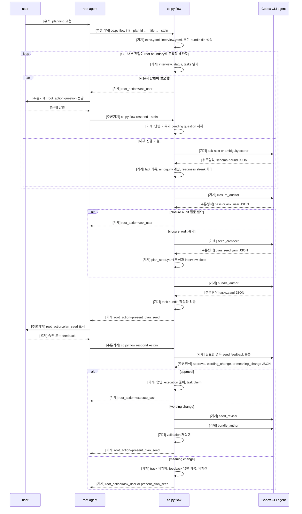
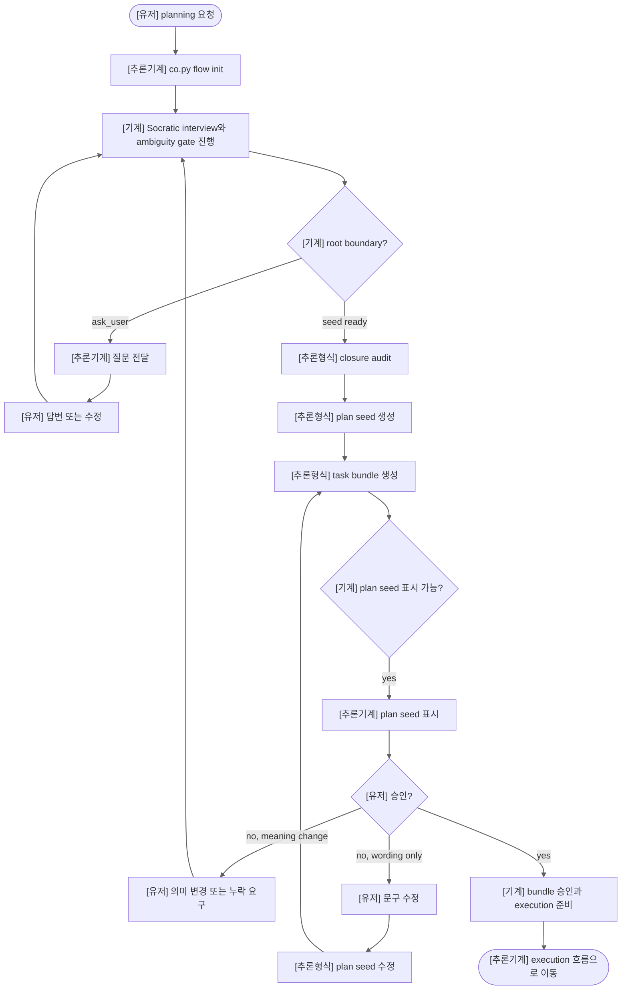
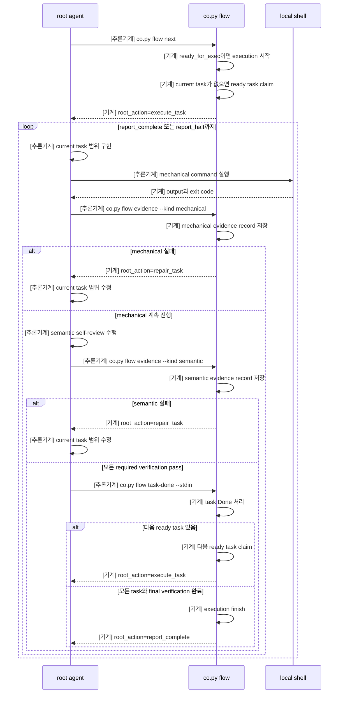
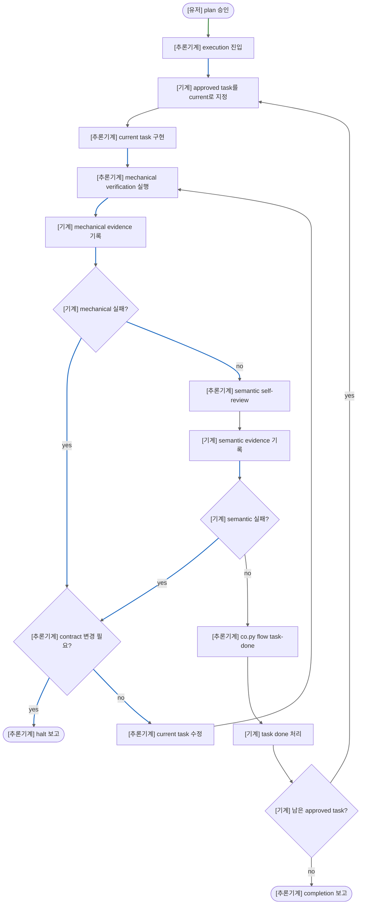

> [!NOTE]
> 일단 내가 써봐야겟다

할거
1. who consumes evidences, notes
2. semantic verificaiton

> README.md 는 나중에 쓰자.

## Coplan

### Sequence Diagram

### Flowchart

## Coexec

### Sequence Diagram

### Flowchart

