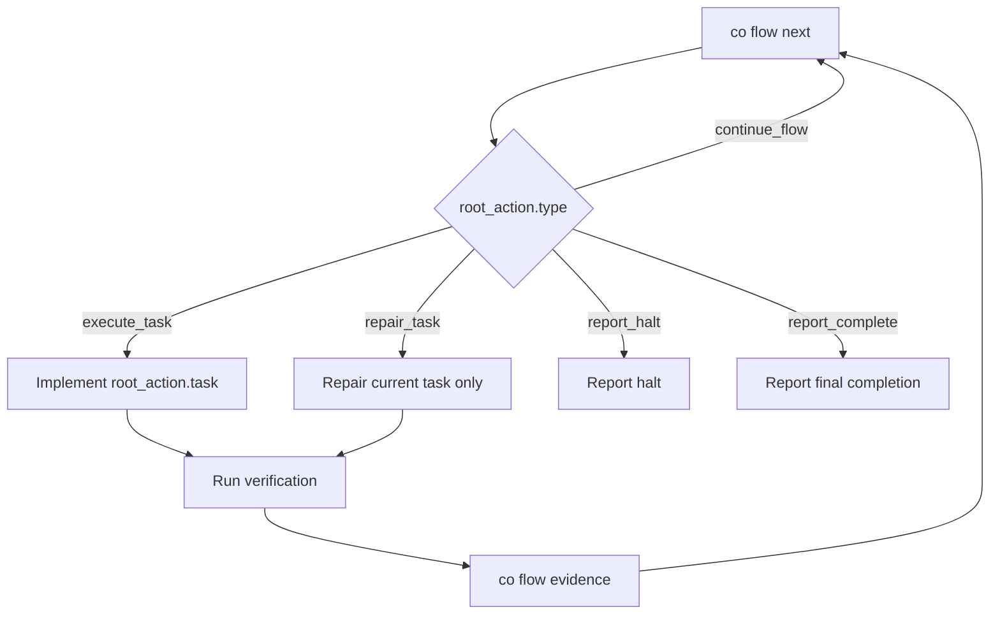

# Coexec Runtime Flow

This README is the synchronized flow map for the `coexec` skill. Keep it aligned with `SKILL.md`, `agents/openai.yaml`, and `skills/coplan/scripts/co` whenever execution order, CLI output, state mutation, evidence, repair, halt, or finish rules change.

## Actors

| Actor | Responsibility |
|---|---|
| User | Receives halt reasons and completion reports. |
| Root agent | Implements only the current task returned by `co flow`. |
| `co` CLI | Owns execution phase transitions, task selection, claims, evidence records, repair records, halt, and finish gates. |
| Bundle files | Store the approved contract and execution state under `.agents/plan/{plan-id}/`. |

## Public Contract

Executor mutation is only:

```bash
co flow next
co flow evidence --step <step-id> --command "<cmd>" --exit-code <code> --success true|false --stdin
co flow repair --field <path> --reason "..." --set|--add|--remove <yaml>
co flow halt --kind user_decision|external_environment --reason "..."
co flow status
```

The root does not call `co exec ...`, claim tasks, complete tasks, or finish execution.

## Execution Flow



`co flow next` starts execution from `ready_for_exec`, claims the next ready task, or finishes when all tasks and final verification are done.

## Evidence

Record verification output through `co flow evidence`:

```bash
<command> 2>&1 | co flow evidence \
  --step <step-id> \
  --command "<command>" \
  --exit-code <code> \
  --success true|false \
  --stdin
```

Successful evidence can complete the current task and advance to the next root boundary. Failed evidence keeps the task `Doing`, records a risk note, and returns `repair_task`.

## Repair And Halt

Repair is limited to the current task envelope:

- `files`
- `implementation_notes`
- `verification`

Halt only for:

- `user_decision`
- `external_environment`

## Execution Gates

| Gate | Enforced by |
|---|---|
| Start | `co flow next` |
| Ready task claim | `co flow next` |
| One `Doing` task | `co flow next` and `co flow evidence` |
| Evidence ledger | `co flow evidence` |
| Task completion | `co flow evidence` |
| Repair envelope | `co flow repair` |
| Halt kind | `co flow halt` |
| Finish | `co flow next` |
