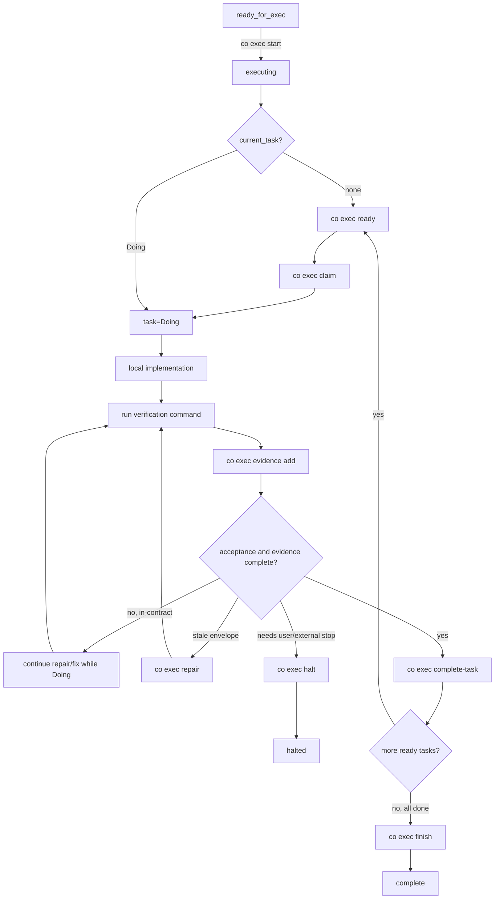
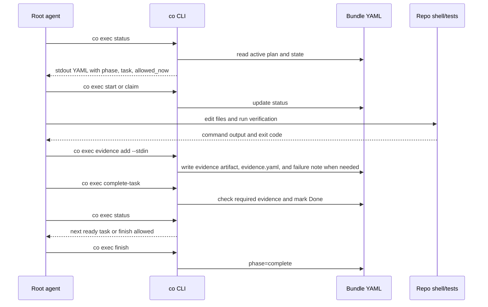

# Coexec Runtime Flow

This README is the synchronized flow map for the `coexec` skill. Keep it aligned with `SKILL.md`, `agents/openai.yaml`, and the shared `coplan/scripts/co` executor commands whenever execution order, CLI output, state mutation, evidence, repair, halt, or finish rules change.

## Actors

| Actor | Responsibility |
|---|---|
| User | Receives progress, halt reasons, and final completion report. |
| Root agent | Executes the approved bundle locally and sequentially through `co`. |
| `co` CLI | Owns all bundle reads, writes, state transitions, evidence records, repair records, halt records, and finish gates. |
| Bundle files | Store the approved contract and execution state under `.agents/plan/{plan-id}/`. |

Executor runtime uses the root agent, local repo commands, and `co`.

## Communication Contracts

| Edge | Mechanism | Input | Output |
|---|---|---|---|
| Root agent -> `co` | Synchronous shell command | CLI args and verification output piped to stdin for evidence | exit code plus stdout YAML |
| `co` -> Root agent | YAML on stdout | current bundle state or mutation result | YAML mappings such as `ok`, `required_action`, `next_command`, `phase`, `allowed_now`, `current_task`, `record`, `note`, `error` |
| `co` -> Bundle | YAML file read/write | command-specific validated state | updated `status.yaml`, `notes.yaml`, `evidence.yaml`, `tasks.yaml` repair envelope, and evidence artifacts |

Root agents should treat `co exec status` as the source of truth for every loop and `required_action` as the primary next-step instruction. `ok: false` means the root agent must satisfy the named gate or correct the command input before continuing. Do not read or edit bundle YAML directly while using `coexec`.

## Execution Flow

1. Load current context.

   ```bash
   co exec status
   ```

   This prints active plan, phase, current task, ready tasks, allowed commands, forbidden commands, evidence state, notes, and drift guard.

2. Start execution if needed.

   ```bash
   co exec start
   ```

   This is allowed only from `ready_for_exec` and moves `status.yaml.phase` to `executing`.

3. Continue or claim exactly one task.

   ```bash
   co exec ready
   co exec claim <task-id>
   ```

   Claim is allowed only for a ready task while no other task is `Doing`.

4. Inspect the current task contract through `co`.

   ```bash
   co exec show-task <task-id>
   ```

   Use task files, verification steps, acceptance criteria, recorded evidence, and task notes from this output.

5. Implement locally inside the approved task scope.

   Stay inside `files.primary`, task context, `must_do`, `must_not_do`, and acceptance criteria. Do not change user-visible behavior, task order, dependencies, non-goals, or acceptance criteria.

6. Record verification evidence.

   ```bash
   <command> 2>&1 | co exec evidence add \
     --task <task-id> \
     --step <step-id> \
     --name <artifact-name.txt> \
     --command "<command>" \
     --exit-code <code> \
     --success true|false \
     --stdin
   ```

   `co` writes the artifact under `evidence/`, appends a manifest record to `evidence.yaml`, and records a `risk` note when the evidence is unsuccessful.

7. Complete the task.

   ```bash
   co exec complete-task <task-id>
   ```

   Completion fails if required evidence is missing. Keep the task `Doing`, repair or record evidence, and retry.

8. Repair only contract-compatible envelope drift.

   ```bash
   co exec repair <task-id> --field <path> --reason "..." --set|--add|--remove <yaml-value>
   ```

   Repair can touch only `files`, `implementation_notes`, or `verification`. It appends a repair note.

9. Halt only for real stop conditions.

   ```bash
   co exec halt --kind user_decision|external_environment --task <task-id> --reason "..."
   ```

   Use halt only when continuing would change the approved user contract or an external environment issue cannot be fixed locally.

10. Finish only after all tasks are done.

    ```bash
    co exec finish
    ```

    Finish requires every task to be `Done` and every `final_verification` task to be `Done`. It moves phase to `complete`.

## State Transitions



## Root Agent and `co` Sequence



## Output Shapes Root Agents Must Read

`co exec status` returns YAML shaped like:

```yaml
active_plan:
  id: my-plan
  dir: .agents/plan/my-plan
ok: true
phase: executing
can_finish: false
current_task:
  id: T1
  title: Add focused test
  status: Doing
progress:
  done: []
  doing:
    - T1
  todo:
    - FV1
  ready_now: []
allowed_now:
  - co exec evidence add --task T1 ...
  - co note append risk --text "..." --why "..." --affects task:T1 --source "coexec"
forbidden_now:
  - claim another task while T1 is Doing
evidence_state:
  required:
    - evidence/t1-focused.txt
  recorded: []
notes:
  recent: []
  current_task: []
halt: null
required_action: Continue current_task; record evidence, repair, complete, or halt using allowed_now.
```

Mutation commands return `ok: true` plus the changed state object. Errors return `ok: false` and `error: '...'` on stdout with a non-zero exit code.

## Execution Gates

| Gate | Enforced By | Blocks When |
|---|---|---|
| Start | `co exec start` | phase is not `ready_for_exec` |
| Claim | `co exec claim` | phase is not `executing`, task is not ready, or another task is `Doing` |
| Evidence | `co exec evidence add` | task is not `Doing`, step id is unknown, or artifact name is unsafe |
| Complete | `co exec complete-task` | task is not current `Doing` or required evidence is missing |
| Repair | `co exec repair` | task is not `Doing` or field is outside `files`, `implementation_notes`, `verification` |
| Halt | `co exec halt` | halt kind is not `user_decision` or `external_environment` |
| Finish | `co exec finish` | phase is `halted`, any task is not `Done`, or final verification is not `Done` |
