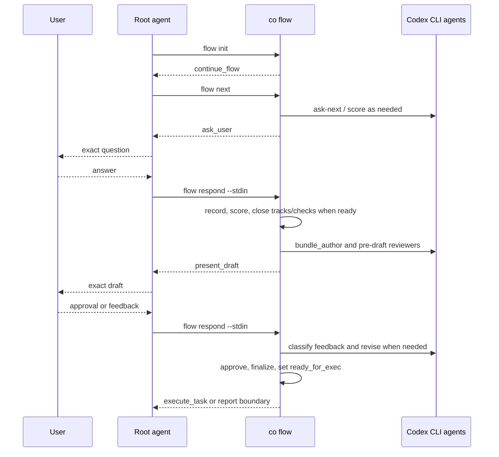

# Coplan Runtime Flow

This README is the synchronized flow map for the `coplan` skill. Keep it aligned with `SKILL.md`, `agents/openai.yaml`, `scripts/co`, and references whenever the planning flow, CLI contract, Codex CLI interaction, bundle schema, or gates change.

## Actors

| Actor | Responsibility |
|---|---|
| User | Supplies intent, interview answers, draft feedback, and approval. |
| Root agent | Calls `co flow`, asks exact questions, presents exact drafts, and transports responses. |
| `co` CLI | Owns bundle state, interview routing, scoring, bundle authoring, validation, review, approval, finalization, and executor handoff. |
| Codex CLI agents | Return schema-bound JSON for interview actions, ambiguity scoring, bundle authoring, draft feedback classification, and pre-draft review. |
| Bundle files | Store durable state under `.agents/plan/{plan-id}/`. |

## Public Contract

Root-facing mutation is only:

```bash
co flow init --plan-id <stable-kebab-id> --title "<title>" [--replace]
co flow next
co flow respond --stdin
co flow status
```

`co flow` returns YAML containing `contract_version`, `mode`, `root_action`, `allowed_commands`, and `forbidden_actions`.

The root follows `root_action.type`; it does not call `co planner ...`, patch bundle files, or choose the next flow.

## Planning Flow



## Internal Gates

| Gate | Enforced by |
|---|---|
| Interview schema, route/source, focus, user-judgment coverage | `co flow next/respond` |
| Ambiguity threshold and clarity floors | `co flow next/respond` through scorer agent and CLI normalization |
| Track closure and closure checks | `co flow next/respond` |
| Bundle schema and task DAG | `co flow next/respond` before draft presentation |
| Pre-draft review freshness | `co flow next/respond` |
| Approval and finalization | `co flow respond --stdin` |

## Root Boundaries

- `ask_user`: user intent is required.
- `present_draft`: user approval or feedback is required.
- `execute_task`: planning is complete; switch to `coexec`.
- `continue_flow`: root should immediately run `co flow next`.

All bundle files remain CLI-owned.
