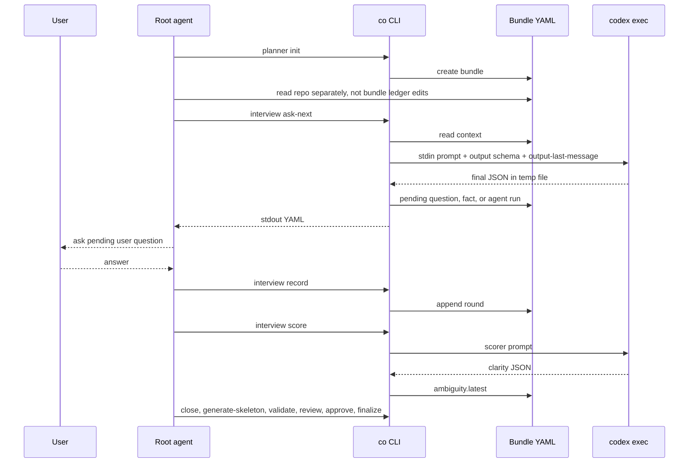
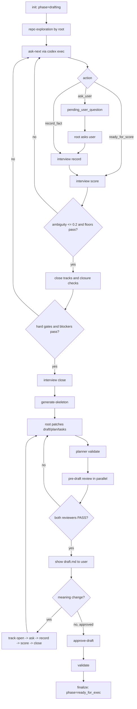

# Coplan Runtime Flow

This README is the synchronized flow map for the `coplan` skill. Keep it aligned with `SKILL.md`, `agents/openai.yaml`, `scripts/co`, and references whenever the planning flow, CLI contract, Codex CLI interaction, bundle schema, or gates change.

## Actors

| Actor | Responsibility |
|---|---|
| User | Supplies intent, decisions, draft feedback, and approval. |
| Root agent | Orchestrates the planning session, explores the repo, calls `co`, asks the user questions, and directly patches only approved bundle files. |
| `co` CLI | Owns bundle state, validates schema, records notes, computes ambiguity, runs Codex CLI agents, and enforces gates. |
| Codex CLI agents | Return read-only JSON judgments for interview next action, ambiguity scoring, and pre-draft review. |
| Bundle files | Store the durable state under `.agents/plan/{plan-id}/`. |

## Communication Contracts

| Edge | Mechanism | Input | Output |
|---|---|---|---|
| Root agent -> `co` | Synchronous shell command | CLI args and occasional stdin | exit code plus stdout YAML |
| `co` -> Root agent | YAML on stdout | internal command result | YAML mappings such as `ok: true`, `required_action`, `next_command`, `pending_user_question`, `ambiguity`, `review` |
| `co` -> Codex CLI | Python `subprocess.run()` | stdin prompt, JSON Schema tempfile, repo cwd | return code, stdout/stderr debug stream, final-message tempfile |
| Codex CLI -> `co` | `--output-last-message` | final assistant message | JSON object parsed by `read_last_message_json()` |

Root agents should treat stdout YAML from `co` as the public API. `required_action` is the primary next-step instruction, and `next_command` is executable when no user decision is needed. `ok: false` means the root agent must satisfy the named gate, fix valid review findings, or correct the command input before continuing. Codex CLI JSON is private to `co`.

## Bundle Layout

```text
.agents/plan/
  exec.yaml
  {plan-id}/
    draft.md
    plan.yaml
    tasks.yaml
    planning_context.yaml
    interview.yaml
    status.yaml
    notes.yaml
    evidence.yaml
    evidence/
```

Direct root-agent edits are allowed only after `co planner generate-skeleton`, and only for:

- `draft.md`
- `plan.yaml`
- `tasks.yaml`

All other bundle files are CLI-owned. `planning_context.yaml` is generated by `co planner generate-skeleton` and is the required context pack for writing `draft.md`, `plan.yaml`, and `tasks.yaml`.

## Planning Flow

1. Initialize the bundle.

   ```bash
   co planner init --plan-id <stable-kebab-id> --title "<title>"
   ```

   `co` creates `exec.yaml`, bundle files, open interview tracks, and `status.yaml.review: not_run`.

2. Root agent explores the local repo.

   The root agent reads the target repo with normal tools and records only exact repo facts as `code_fact` when needed.

3. Ask the Codex CLI interview agent for the next action.

   ```bash
   co planner interview ask-next
   ```

   Possible actions:

   - `ask_user`: `co` creates `pending_user_question`; root asks the user and records the answer.
   - `record_fact`: `co` records a safe `code_fact` or `research_confirmation`.
   - `ready_for_score`: root runs ambiguity scoring next.

4. Record user answers through `co`.

   ```bash
   co planner interview record \
     --route user_decision \
     --track scope \
     --question "<pending question>" \
     --answer "<user answer>" \
     --source "from-user:<summary>"
   ```

   User-owned decisions must match a pending question.

5. Score ambiguity with Codex CLI.

   ```bash
   co planner interview score --mode auto
   ```

   Codex CLI returns clarity component scores. `co` computes:

   ```text
   weighted_clarity = sum(clarity_i * weight_i)
   ambiguity = 1 - weighted_clarity
   ```

   Readiness requires `ambiguity <= 0.2` plus all clarity floors.

6. Close tracks and root acceptance checks.

   ```bash
   co planner interview track close <track> --summary "..."
   co planner interview closure-check <check> --summary "..."
   co planner interview blocker add|clear --reason "..."
   ```

   Root acceptance is represented by closure checks and material blockers.

7. Close the interview.

   ```bash
   co planner interview close --summary "..."
   ```

   `co` blocks close if tracks, user-judgment rounds, pending questions, route sources, focus limits, closure checks, material blockers, ambiguity, floors, or score freshness fail.

8. Generate skeleton files.

   ```bash
   co planner generate-skeleton
   ```

   `co` builds `planning_context.yaml`, enforces the internal planning context gate, then writes starter `draft.md`, `plan.yaml`, and `tasks.yaml`.

9. Root agent patches the bundle contract.

   Read `planning_context_file` from stdout, then patch only `draft.md`, `plan.yaml`, and `tasks.yaml` with the smallest correct diff.

10. Validate and run pre-draft review.

    ```bash
    co planner validate
    co planner review run --stage pre-draft
    ```

    `contract_reviewer` and `verification_reviewer` run in parallel through Codex CLI. Both must return `PASS`.

11. Show only `draft.md` to the user.

    ```bash
    co show --file draft
    ```

    Meaning-changing feedback reopens the affected interview track before recording a new answer.

12. Approve and finalize.

    ```bash
    co planner approve-draft --comment "<summary>"
    co planner validate
    co planner finalize
    ```

    `finalize` requires an approved draft, fresh pre-draft review fingerprint, valid plan/tasks, and a closed ambiguity-ready interview.

## Internal Gate Logic

| Gate | Enforced By | Blocks When |
|---|---|---|
| Interview schema | `validate_interview()` | malformed tracks, rounds, pending question, ambiguity, or closure state |
| Route/source | `validate_interview()` | source prefix does not match route |
| Non-user streak | `planner_interview_record()` and close blockers | three non-user answers are followed by another non-user answer |
| Track focus | `interview_focus_blocker()` | one track is over-focused while other tracks remain open |
| Ambiguity | `normalize_ambiguity_score()` and close blockers | score is stale, above threshold, floor failed, or not ready |
| Root acceptance | closure checks and blockers | user-visible gaps or material questions remain |
| Review freshness | `review_fingerprint()` | `plan.yaml`, `tasks.yaml`, or `interview.yaml` changed after review |
| Finalize | `planner_finalize()` | draft approval, review, validation, or interview close is missing |

## Root Agent and Codex CLI Sequence



## Planner State Graph


