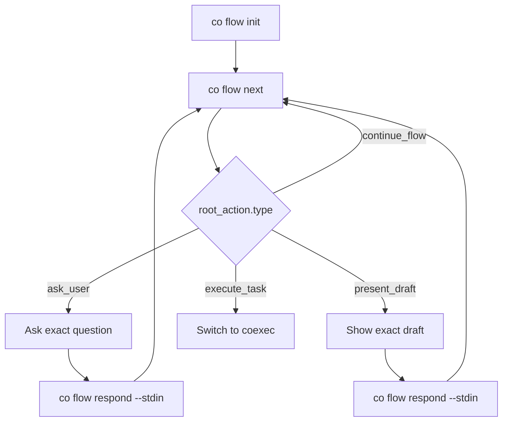
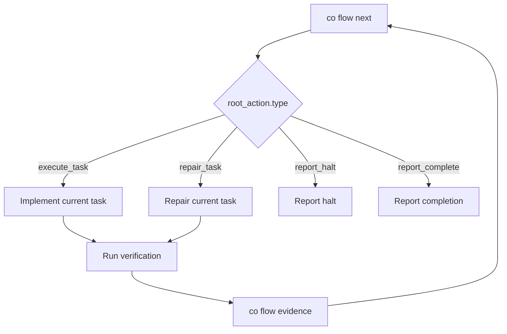

# Root Agent Co Guide

This guide is for the root agent that calls `co`. The root agent is a thin adapter: run `co flow`, parse stdout YAML, perform the exact `root_action`, and send user or verification output back through `co flow`.

## Public Commands

Root-facing mutation commands are limited to:

```bash
co flow init --plan-id <id> --title "<title>" [--replace]
co flow next
co flow respond --stdin
co flow evidence --step <step-id> --command "<cmd>" --exit-code <code> --success true|false --stdin
co flow repair --field <path> --reason "..." --set|--add|--remove <yaml>
co flow halt --kind user_decision|external_environment --reason "..."
co flow status
```

Read-only and diagnostics:

```bash
co current
co show --file draft|plan|tasks|planning-context|interview|status|notes|evidence
co doctor
co review-context
```

Removed public surfaces:

- `co planner ...`
- `co exec ...`
- `co note append ...`

## Flow Stdout Contract

Every `co flow` command returns YAML with:

```yaml
ok: true
contract_version: '1'
mode: planner|executor|halted|complete|error
phase: drafting
root_action:
  type: ask_user|present_draft|execute_task|repair_task|report_halt|report_complete|continue_flow
allowed_commands: []
forbidden_actions: []
```

Root-agent rules:

- Always parse `root_action.type` before acting.
- Use only `allowed_commands`.
- Never do anything in `forbidden_actions`.
- Do not infer route, track, score, close readiness, task readiness, completion, or finish state.
- Do not edit bundle YAML directly.

## Root Actions

| Type | Root action |
|---|---|
| `ask_user` | Ask `root_action.question` exactly. Pipe the user's answer to `co flow respond --stdin`. |
| `present_draft` | Show `root_action.draft`. Pipe approval or feedback to `co flow respond --stdin`. |
| `execute_task` | Implement only `root_action.task`; run verification; record output with `co flow evidence`. |
| `repair_task` | Repair only the current task envelope, then rerun verification and record evidence. |
| `report_halt` | Stop and report `root_action.halt`. |
| `report_complete` | Report final completion. |
| `continue_flow` | Run `root_action.next_command`, normally `co flow next`. |

## Planner Iterator

The root does not call interview, score, close, validate, review, approve, or finalize commands.



`co flow` owns pending question metadata, user answer recording, ambiguity scoring, track closure, closure checks, bundle authoring, validation, pre-draft review, draft feedback classification, approval, and finalization.

## Executor Iterator

The root does not call start, ready, claim, complete, or finish commands.



`co flow` owns phase transitions, ready task selection, task claiming, evidence ledger updates, task completion, next task selection, halt, and finish gates.
