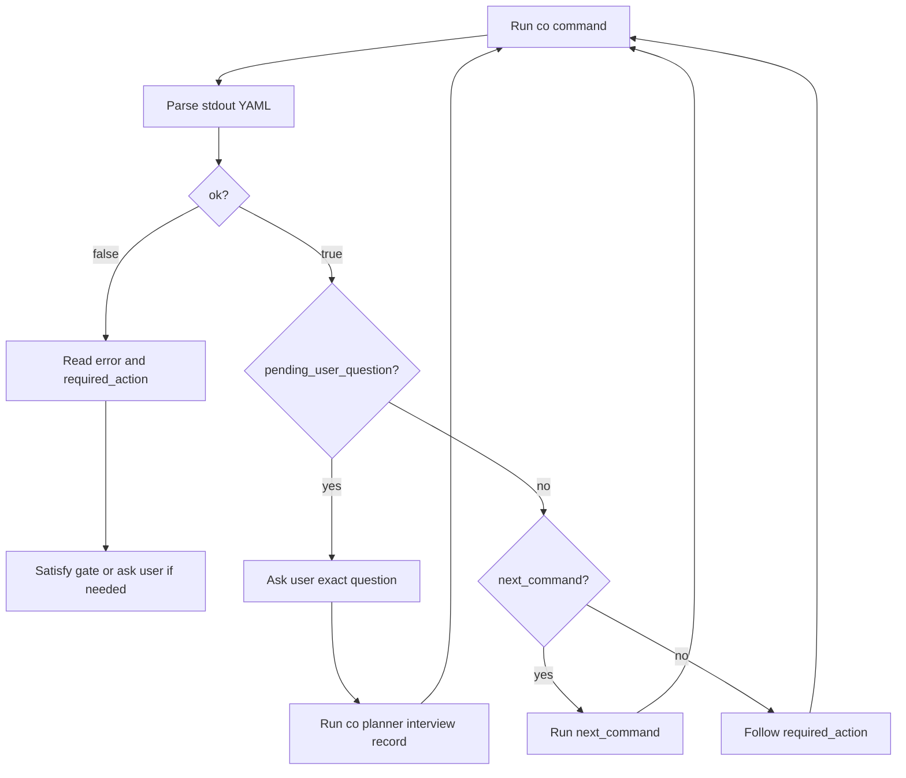

# Root Agent Co Guide

This guide is for the root agent that calls `co`. The root agent should stay thin: run `co`, parse stdout YAML, follow `required_action`, ask the user only when `co` has created a pending user question, and patch only files that the current phase permits.

## Common Stdout Contract

Most root-agent-facing `co` commands return YAML on stdout:

```yaml
ok: true
required_action: Next action for the root agent in natural language.
next_command: optional exact command to run next
...
```

Gate failures or failed commands return `ok: false`. Invalid command input also returns a non-zero exit code. Error-shaped output looks like:

```yaml
ok: false
error: 'why the command failed'
required_action: 'Read error, satisfy the blocked gate or fix command input, then rerun the appropriate co command.'
```

Root-agent rules:

- Always parse stdout YAML before deciding the next step.
- Treat `required_action` as the primary instruction.
- If `next_command` is present and no user decision is needed, run it.
- If `pending_user_question` is present, ask the user that exact question, then record the answer.
- If `ok: false`, do not invent a bypass; satisfy the named gate, patch valid review findings, or ask the user when the gate requires user judgment.
- Extra fields are command-specific context; use them to perform `required_action`, but do not replace `required_action` with your own gate logic.

Exceptions:

- `co show --file draft` prints raw Markdown for user review.
- `co show --file plan|tasks|planning-context|interview|status|notes|evidence` prints the requested YAML file.
- `co review-context` prints a large YAML context bundle for diagnostics.

## General Commands

| Command | Expected stdout keys | Root action |
|---|---|---|
| `co current` | `ok`, `active_plan_id`, `plan_dir`, `required_action` | Use the active bundle pointer, then continue the planner or executor flow. |
| `co doctor` | `ok`, Python/YAML environment fields, `required_action` | Continue when `current_python_yaml` or `bootstrap_python_yaml` is true; otherwise fix the environment issue. |

## Planner Commands

| Command | Expected stdout keys | Root action |
|---|---|---|
| `co planner init --plan-id <id> --title "<title>"` | `ok`, `active_plan_id`, `plan_dir`, `required_action`, `next_command` | Explore the repo, then run `next_command`. |
| `co planner interview status` | `ok`, `status`, `draft_ready`, `open_tracks`, `closure_blockers`, `ambiguity`, `required_action` | Read blockers and follow `required_action`. |
| `co planner interview ask-next` | `ok`, `action`, possibly `pending_user_question`, `reason`, `required_action`, possibly `next_command` | Ask the user, accept auto-recorded fact, or run `next_command`. |
| `co planner interview ask ...` | `ok`, `pending_user_question`, `required_action` | Ask the user exactly `pending_user_question.question`. |
| `co planner interview record ...` | `ok`, `round`, `non_user_answer_streak`, `required_action`, `next_command` | Run `next_command` to score ambiguity. |
| `co planner interview score --mode auto` | `ok`, `ambiguity`, `required_action` | If not ready, ask the recommended follow-up. If ready, close tracks/checks and close the interview. |
| `co planner interview track close <track> --summary "..."` | `ok`, `track`, `status`, `required_action` | Continue remaining track/check gates or close the interview. |
| `co planner interview track open <track> --reason "..."` | `ok`, `track`, `status`, `required_action` | Create a pending question, record the answer, rescore, and close again. |
| `co planner interview closure-check <check> --summary "..."` | `ok`, `check`, `passed`, `required_action` | Continue remaining closure checks or close the interview. |
| `co planner interview blocker add|clear --reason "..."` | `ok`, `material_blockers`, `required_action` | Resolve blockers; close only when blockers are empty. |
| `co planner interview close --summary "..."` | `ok`, `status`, `draft_ready`, `required_action`, `next_command` | Run `next_command` to generate skeleton files. |
| `co planner generate-skeleton` | `ok`, `written`, `planning_context_file`, `required_action`, `next_command` | Read `planning_context_file`, patch only `draft.md`, `plan.yaml`, and `tasks.yaml`, then validate. |
| `co planner validate` | `ok`, `validated`, `required_action` | Run pre-draft review, approve draft, or finalize depending on current phase. |
| `co planner review run --stage pre-draft` | `ok`, `review`, `results`, `required_action`, `next_command` | If PASS, show draft. If FAIL, patch valid findings and rerun review. |
| `co planner review status` | `ok`, `review`, `required_action` | Continue review, approval, or finalize path. |
| `co planner approve-draft --comment "..."` | `ok`, `phase`, `required_action`, `next_command` | Run validate, then finalize. |
| `co planner finalize` | `ok`, `phase`, `required_action`, `next_command` | Switch to `coexec` and start with `co exec status`. |

## Planner Ask-Next Outputs

`ask-next` can return three actions.

### `ask_user`

```yaml
ok: true
action: ask_user
pending_user_question:
  id: Q2
  route: user_decision
  track: verification
  question: Which command proves success?
reason: Verification success is not user-confirmed.
required_action: Ask the user pending_user_question.question exactly, then record the answer with `co planner interview record`.
```

Root action:

1. Ask the user the exact question.
2. Record with matching route, track, question, answer, and `from-user...` source.

### `record_fact`

`co` records the fact and returns the normal `interview record` output.

Root action:

- Follow `required_action`, usually ambiguity scoring.

### `ready_for_score`

```yaml
ok: true
action: ready_for_score
reason: Enough interview material exists.
required_action: Run the command in next_command.
next_command: co planner interview score --mode auto
```

Root action:

- Run `next_command`.

## Executor Commands

| Command | Expected stdout keys | Root action |
|---|---|---|
| `co exec status` | `ok`, `phase`, `active_plan`, `current_task`, `progress`, `allowed_now`, `forbidden_now`, `notes`, `required_action`, maybe `next_command` | Follow `required_action`, `allowed_now`, `forbidden_now`, and task notes. |
| `co exec start` | `ok`, `phase`, `required_action`, `next_command` | Run `next_command`. |
| `co exec ready` | `ok`, `ready_now`, `required_action` | Claim exactly one ready task or return to status. |
| `co exec claim <task-id>` | `ok`, `task`, `status`, `required_action` | Execute the task and record evidence. |
| `co exec show-task <task-id>` | `ok`, `task`, `status`, `evidence`, `notes`, `required_action` | Use task contract, evidence, and task notes for implementation and verification. |
| `co exec evidence add ... --stdin` | `ok`, `record`, maybe `note`, `required_action`, maybe `next_command` | If success and complete, run `next_command`; if failed, use the risk note and continue repair/fix. |
| `co exec repair <task-id> ...` | `ok`, `note`, `required_action` | Rerun verification and record evidence. |
| `co exec complete-task <task-id>` | `ok`, `task`, `status`, `required_action`, `next_command` | Run `next_command` to choose the next task or finish. |
| `co exec halt ...` | `ok`, `phase`, `halt`, `note`, `required_action` | Stop and report the halt reason to the user. |
| `co exec finish` | `ok`, `phase`, `required_action` | Report final completion. |

## Executor Status Output

`co exec status` is the executor root loop. It returns the current command menu:

```yaml
ok: true
phase: executing
current_task:
  id: T1
  title: Add focused test
  status: Doing
progress:
  done: []
  doing:
    - T1
  todo:
    - FV1
  ready_now: []
allowed_now:
  - co exec evidence add --task T1 ...
  - co note append risk --text "..." --why "..." --affects task:T1 --source "coexec"
  - co exec repair T1 --field <path> --reason "..."
  - co exec complete-task T1
  - co exec halt --kind user_decision|external_environment --task T1 --reason "..."
forbidden_now:
  - claim another task while T1 is Doing
required_action: Continue current_task; record evidence, repair, complete, or halt using allowed_now.
notes:
  recent: []
  current_task: []
```

Root action:

- Do not inspect bundle YAML directly.
- Choose only commands listed or implied by `allowed_now`.
- Never do something listed in `forbidden_now`.

## Thin Root-Agent Loop


